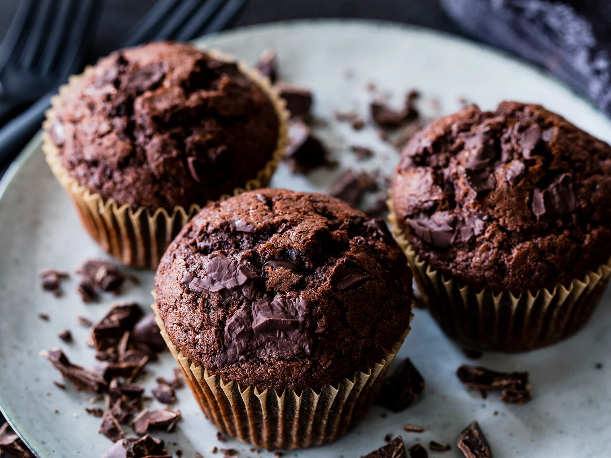

# 405muffins

## Schokomuffins Rezept

---

---

12 Muffinförmchen

---

**Zutaten**

_Für die Muffins_

**125 g** weiche Butter
**150 g** Zucker
**1 Pck.** Vanillezucker
**2** Eier
**200 g** Zartbitterschokolade
**200 g** Mehl
**4 EL** Backkakao
**1 Prise** Salz
**2 TL** Backpulver
**175 g** Milch

---

**1. Schritt**

Butter mit Zucker und Vanillezucker verrühren. Eier unterrühren. Zartbitterschokolade grob hacken. Ofen auf 180 Grad (Umluft: 160 Grad) vorheizen. Mehl mit Kakaopulver, Salz und Backpulver vermischen. Mehlmischung mit der Milch zur Butter-Zuckermischung geben und alles gut verrühren. Etwa zwei Drittel der gehackten Schokolade unterheben.

---

**2.Schritt**

Die Mulden eines Muffinblechs mit Förmchen auslegen. Mit einem Eisportionierer den Teig auf die Förmchen verteilen. Die restlichen gehackten Schokostückchen auf den Muffins verteilen. Im vorgeheizten Ofen ca. 25 Min backen.

**Link zum Rezept**
[Hier](https://www.einfachbacken.de/rezepte/schokomuffins-saftig-schnell)g

